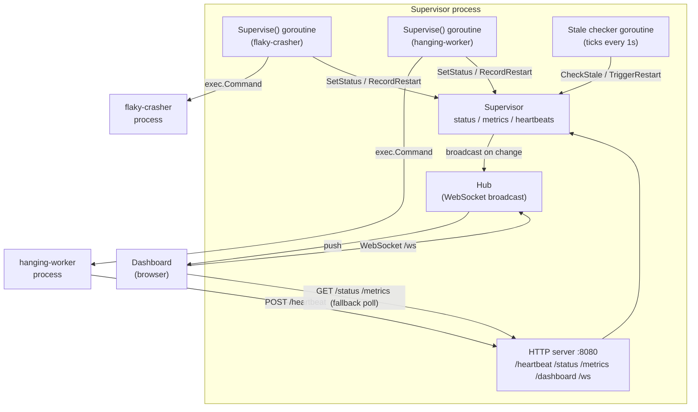

# watchdog

A small Go service supervisor that detects two kinds of failure — crashes
and silent hangs — and automatically restarts whatever fails, with a live
dashboard to watch it happen.

## Why this exists

At a previous internship, a production service failed silently: it didn't
crash, didn't log an error, it just stopped doing anything useful while
still technically "running." Nothing paged anyone, because nothing was
watching for *that*. This project is a from-scratch reimplementation of the
piece that was missing — a supervisor that catches both failure modes, not
just the one (process exit) that's easy to notice.

## What it catches

| Failure mode | How it's detected | Demo service |
|---|---|---|
| **Crash** | The process exits on its own | `flaky-crasher` (`sh -c "sleep 3 && exit 1"`) |
| **Hang** | The process is still running but stops sending heartbeats | `hanging-worker` (`fakeservice/`, sends 3 heartbeats then goes silent) |

Both are restarted automatically, and both show up identically on the
dashboard and in the metrics — the whole point is that "still running" and
"actually healthy" are different questions, and only heartbeats can answer
the second one.

## Architecture



**Crash path:** `Supervise()` starts the process with `cmd.Start()` and
watches `cmd.Wait()` in a goroutine. If it exits, `Supervise()` sees it
immediately and restarts.

**Hang path:** `hanging-worker` POSTs to `/heartbeat` periodically. A
background goroutine ticks every second, calls `CheckStale` (any service
silent for >3s), and signals that service's `Supervise()` loop over a kill
channel to force-restart it — even though the process itself never exited.

**Live dashboard:** every status change and every restart is pushed
through a `Hub` to all connected WebSocket clients (`/ws`), so tiles flip
color the instant something happens. If the socket can't connect, the
dashboard falls back to polling `/status` and `/metrics` once a second.

## Running it

```bash
go build -o bin/fakeservice ./fakeservice
go run .
```

Then open **http://localhost:8080/dashboard**.

## Endpoints

| Endpoint | Purpose |
|---|---|
| `POST /heartbeat` | A supervised service reports `{"name": "..."}` to say it's alive |
| `GET /status` | Current status of every supervised service, as JSON |
| `GET /metrics` | Per-service incident history: restart count, last/total downtime |
| `GET /dashboard` | The live HTML dashboard |
| `GET /ws` | WebSocket endpoint the dashboard uses for live push updates |

## Project layout

```
main.go          Supervisor, Supervise(), HTTP handlers, dashboard HTML/JS
hub.go           Hub: broadcasts status changes to connected WebSocket clients
ws.go            /ws handler: upgrades the connection, wires it to the Hub
metrics.go       Incident history: restart counts, downtime tracking
fakeservice/     Standalone demo binary simulating a service that hangs
```

## Demo

_[Demo GIF goes here — record a terminal + browser session showing
`hanging-worker` go silent, the tile flip red, and the automatic restart
recovering it live.]_

## Roadmap

- [x] Crash detection and auto-restart
- [x] Heartbeat-based hang detection and auto-restart
- [x] Live dashboard (polling, then WebSocket push)
- [x] Incident history (restart counts, downtime)
- [ ] Multi-watchdog clustering, so the watchdog itself isn't a single
      point of failure
